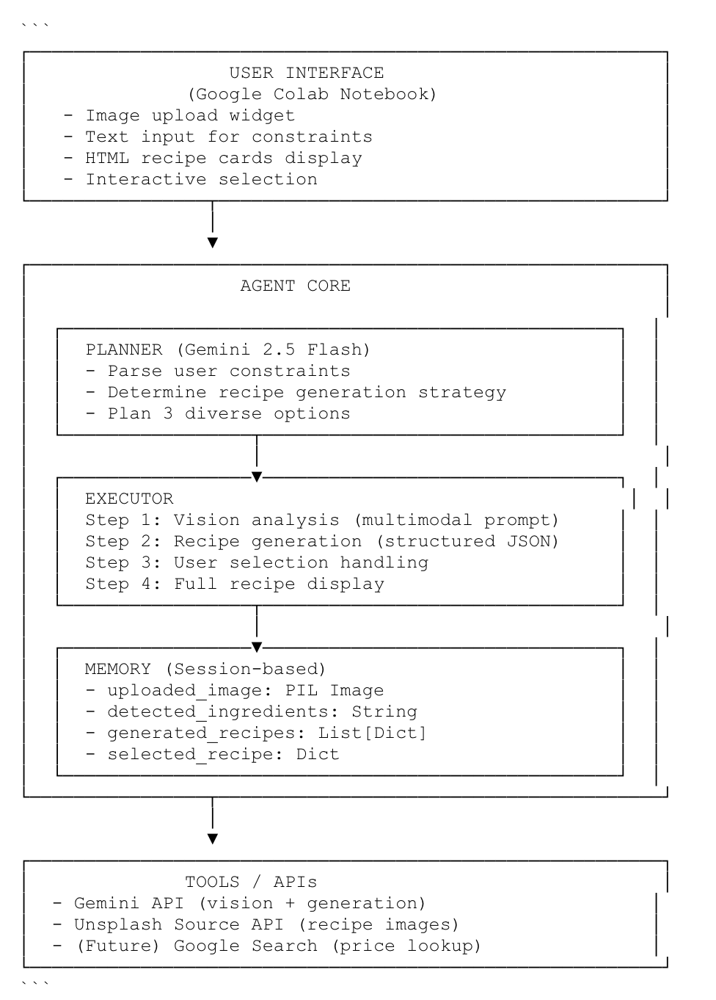

## 2. `ARCHITECTURE.md`

```markdown
# Architecture Overview
# Architecture Overview

Below is a high-level overview of the Healthy Budget Chef agent architecture.

## System Diagram



## Components

### 1. User Interface
- **Platform**: Google Colab Notebook
- **Input Methods**:
  - File upload widget for fridge images
  - Text input for meal constraints
  - Numeric selection (1-3) for recipe choice
- **Output Display**:
  - Inline image preview
  - HTML-styled recipe cards with images
  - Formatted text recipe with instructions
  - Shopping list export options

### 2. Agent Core

#### **Planner**
- **Location**: `detect_ingredients()` and `generate_recipe_options()`
- **Function**: 
  - Analyzes available ingredients from image
  - Interprets user constraints (dietary, time, budget)
  - Plans 3 diverse recipe options with different optimization goals:
    - Option 1: Fastest prep time
    - Option 2: Highest waste reduction
    - Option 3: Fewest missing items
- **Strategy**: Single LLM call with comprehensive prompt engineering

#### **Executor**
- **Location**: Main workflow functions across cells 4-8
- **Logic Flow**:
  ```python
  1. upload_fridge_image() → PIL Image
  2. detect_ingredients(image) → Gemini API call → Ingredient list
  3. get_user_constraints() → User input → Constraint string
  4. generate_recipe_options(ingredients, constraints) 
     → Gemini API call → 3 recipes JSON
  5. display_recipe_options(recipes) → HTML rendering
  6. select_recipe(recipes) → User choice → Selected recipe
  7. display_full_recipe(selected) → Formatted output
  ```


#### **Memory**
- **Type**: In-memory session state (Python variables)
- **Stored Data**:
  - `test_image`: PIL Image object
  - `detected_ingredients`: String (categorized list)
  - `generated_recipes`: List of 3 recipe dictionaries
  - `selected_recipe`: Single recipe dictionary
- **Persistence**: None (session-only, resets on notebook restart)
- **Future**: Local JSON files or cloud database for user preferences

### 3. Tools / APIs

| Tool | Purpose | Integration Method |
|------|---------|-------------------|
| **Gemini 2.5 Flash** | Vision analysis & recipe generation | `google.generativeai.GenerativeModel()` |
| **Unsplash Source API** | Recipe images | Direct URL construction (no auth) |
| **Google Search** (planned) | Real-time price lookup | Gemini function calling |

**Example API Call**:
```python
model = genai.GenerativeModel('models/gemini-2.5-flash')
response = model.generate_content([prompt, image])
```

### 4. Observability

#### **Logging**
- **Console Output**: Step-by-step progress indicators
  ```
  🔍 Analyzing image with Gemini Vision...
  ✅ Analysis complete!
  📋 DETECTED INGREDIENTS: ...
  ```
- **Error Handling**: Try-catch blocks with informative messages
  ```python
  try:
      recipe_data = json.loads(response_text)
  except json.JSONDecodeError as e:
      print(f"⚠️ JSON parsing error: {e}")
      print("Raw response:", response.text[:500])
  ```

#### **Tracing**
- Each cell prints its function name and status
- API responses are partially displayed for verification
- JSON parsing errors show raw output for debugging

#### **Testing**
- Manual testing via sequential cell execution
- Visual verification of ingredient detection
- User acceptance testing of recipe quality

## Data Flow

```
Image Upload
    ↓
Gemini Vision API (multimodal)
    ↓
Ingredient String List
    ↓
User Constraint Input
    ↓
Gemini Generation API (JSON mode)
    ↓
3 Recipe Objects + Unsplash Image URLs
    ↓
HTML Card Rendering
    ↓
User Selection (1-3)
    ↓
Full Recipe Display
    ↓
Shopping List Export (Email/Text)
```

## Key Design Decisions

1. **Single Notebook**: All code in one Colab file for easy demo and judging
2. **No Database**: Session-only memory for hackathon simplicity
3. **Gemini 2.5 Flash**: Balance of speed, cost, and quality
4. **3 Options**: User choice improves satisfaction vs. single "best" answer
5. **Structured JSON**: Reliable parsing via schema enforcement in prompt
